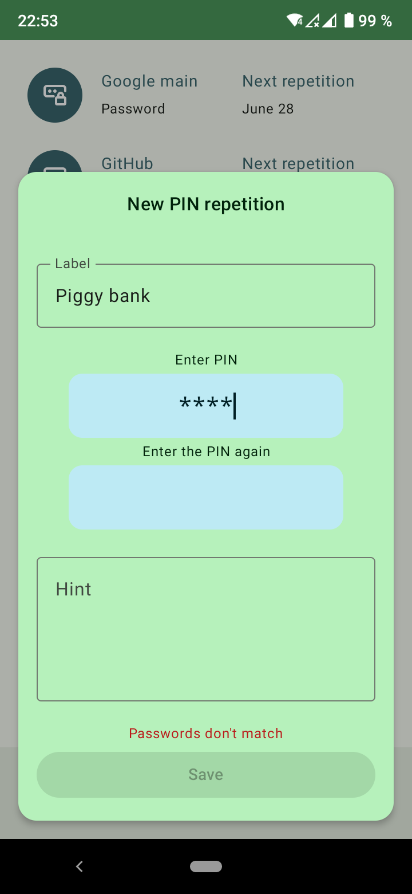
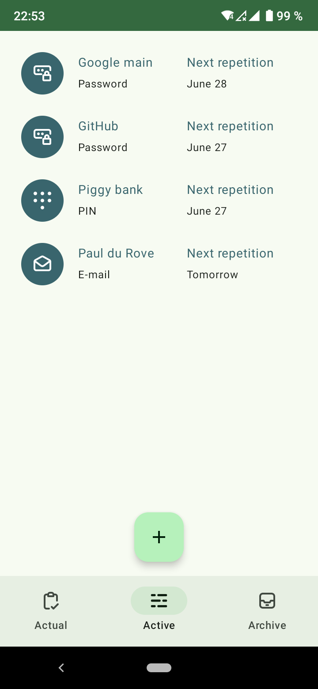
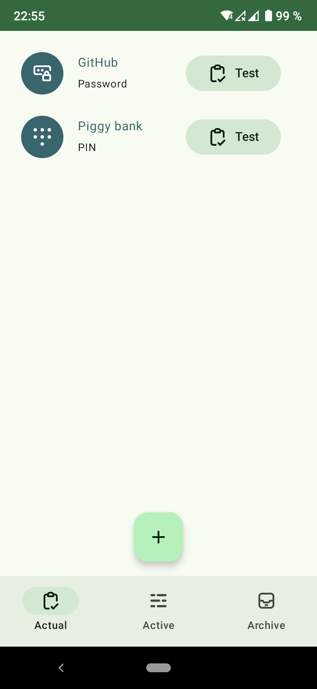
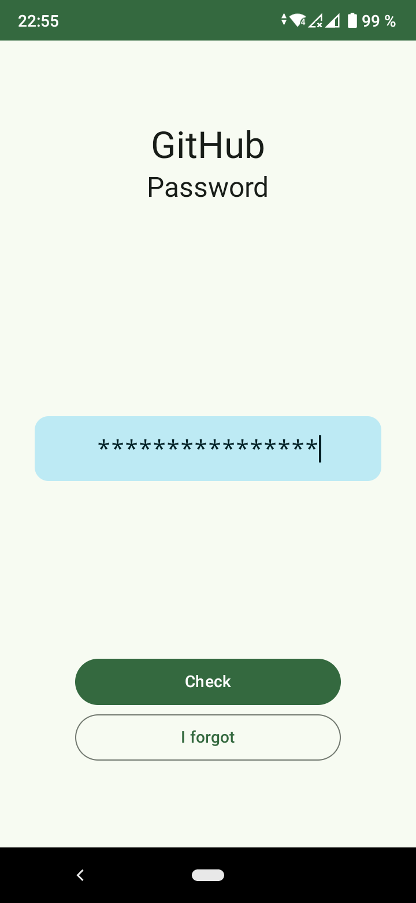
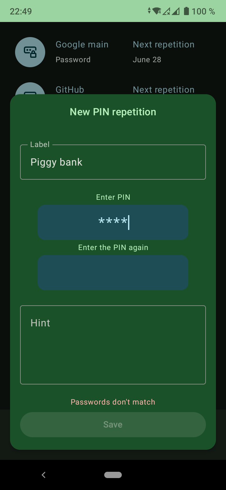
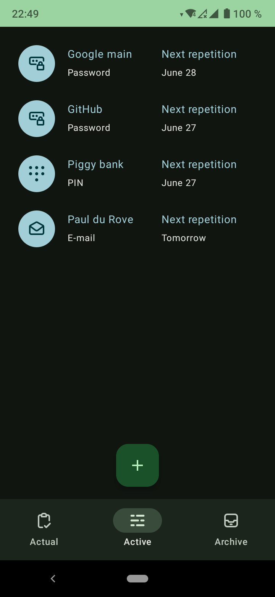
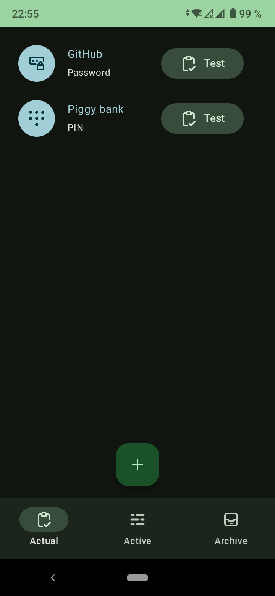
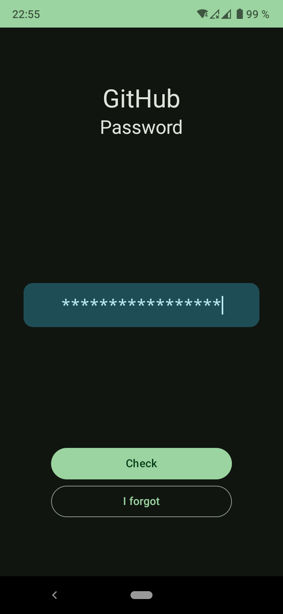

# Intervals

Intervals is an Android app for remembering passwords, PIN codes, and emails.
The idea is similar to the idea of [retrieval practice](https://en.wikipedia.org/wiki/Testing_effect).
The application **DOES NOT** store passwords or any other sensitive data,
a [salted](https://en.wikipedia.org/wiki/Salt_(cryptography)) [hash](https://en.wikipedia.org/wiki/Cryptographic_hash_function) is stored instead.
Having a hash and a salt is enough to check whether entered data matches the original.
And if your device is lost or hacked, no one will be able to access your secret data.

   

   

## Building
In Android Studio use `Build` > `Generate Signed Bundle / APK...`